<div align="center">

# smve-lab

**An independent, from-scratch evaluation of SMVE (Sparse Multi-Vector Encoding) for late-interaction retrieval,
against exhaustive MaxSim, MUVERA, BM25, BGE-M3 dense / lexical, a cross-encoder reranker,
and a Jev-based reranking router.**


</div>

---

## TL;DR

[SMVE](https://www.topk.io/blog/20260311-smve-multi-vector-retrieval) turns a bag of ColBERT token vectors into
**one sparse vector** whose dot product approximates late-interaction **MaxSim**. That makes multi-vector retrieval
servable from an ordinary inverted index. This repo re-implements it from the blog description, then tests it in
four stages on three BEIR datasets with the **same BGE-M3 embeddings for every method**.

| | finding |
|---|---|
| **Quality, standalone** | With BGE-M3, standalone SMVE (best nDCG@10 **0.598** on SciFact) trails a single 1024-d dense vector (**0.654**) and exact MaxSim (**0.699**) on all three datasets. |
| **Why** | **Headroom is small**: MaxSim beats dense by only +0.045 (SciFact), +0.028 (NFCorpus), and *loses* by 0.042 on ArguAna. An approximation of MaxSim can't add more than that. |
| **SMVE vs MUVERA** | At **equal storage SMVE wins clearly** (Recall@100 0.857 vs 0.705 at ≤ 100 MB); at equal latency they're roughly tied (~10–20 ms). |
| **Repetitions** | Running SMVE R times with fresh anchors is **not** a free improvement: at equal budget it **ties** one wider matrix, both in a controlled token-pair experiment and in retrieval (mean Δ −0.0007 nDCG@10 over 30 pairs). |
| **Real latency** | With a hand-built inverted index SMVE drops from 87 ms to **19 ms** per query; ~90 % of that is projecting the query onto a 268 MB anchor matrix. SMVE queries read **~58× more postings than BM25**. |
| **Best pipelines** | Cheap: **BM25 → MaxSim rerank (0.709)** beats exhaustive MaxSim on SciFact (a first stage should *complement* its reranker). Best quality: dense + lexical → `bge-reranker-v2-m3` @20 (**0.731**, ~1.6 s/query). |
| **Routing** | An oracle that calls the cross-encoder only when it helps would be *better and ~5–6× cheaper* than always calling it. Real routers capture ~20–27 % of that. **Jev** adds real signal on SciFact (+0.08 AUC when combined with first-stage features, p = 0.001), not on ArguAna. |
| **Jev as the reranker** | Reranking the same top 20, **Jev beats `bge-reranker-v2-m3` significantly on SciFact (0.784 vs 0.731) and NFCorpus (0.366 vs 0.342)**. On ArguAna the cross-encoder wins against per-pair Jev and ties Jev's one-call-per-query variant (0.692 vs 0.698). ~160–260 ms per query via API, ~$0.0003–0.0007 per query. |

<p align="center">
  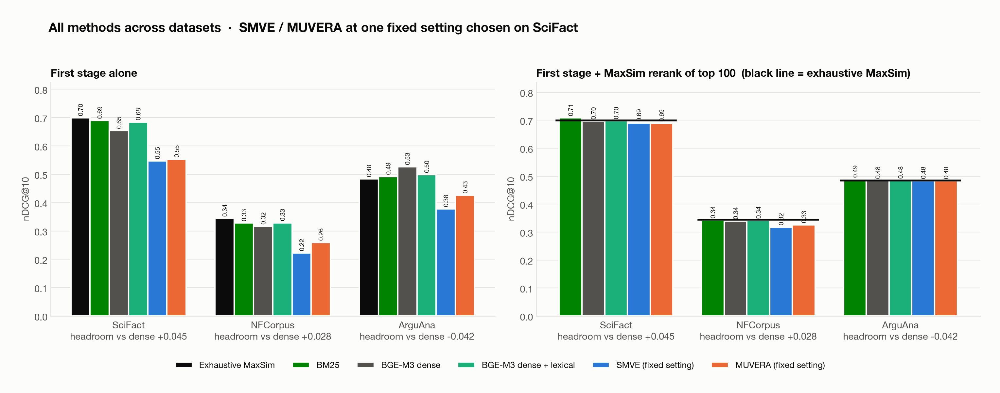
  <br><em>Every method on every dataset. Left: first stage alone. Right: after exact MaxSim reranks each first stage's top 100 (black line = exhaustive MaxSim).</em>
</p>

---

## Contents

1. [Background: the retrieval pipeline](#1-background-the-retrieval-pipeline)
2. [Setup](#2-setup)
3. [Stage 1: exact MaxSim, the ground truth](#3-stage-1-exact-maxsim-the-ground-truth)
4. [Stage 2: SMVE by hand](#4-stage-2-smve-by-hand)
5. [Stage 3: the alternatives, real latency, more datasets](#5-stage-3-the-alternatives-real-latency-more-datasets)
6. [Stage 4: when is the expensive reranker worth it? (Jev router)](#6-stage-4-when-is-the-expensive-reranker-worth-it-jev-router)
7. [Conclusions](#7-conclusions)
8. [Limitations](#8-limitations)
9. [Reproduce](#9-reproduce)
10. [Repository layout](#10-repository-layout)
11. [References](#11-references)

---

## 1. Background: the retrieval pipeline

Search has **two jobs**. A cheap **first stage** scans the whole corpus and returns ~100 candidates; an accurate
**reranker** re-orders them. A reranker can only re-order what the first stage found.

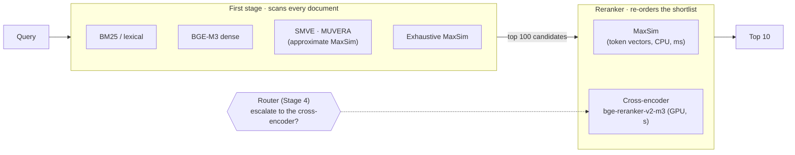

**MaxSim (late interaction, ColBERT).** Every query token finds its best-matching document token; the matches are summed:

$$\text{MaxSim}(q, d) = \sum_{i \in q} \max_{j \in d} \; q_i \cdot d_j$$

Accurate, but it needs every token vector of every document (3.8 GB for SciFact's 5,183 abstracts at 1024-d fp16)
and work proportional to *query tokens × corpus tokens*.

**SMVE.** Collapse each bag of token vectors into one high-dimensional **sparse** vector:

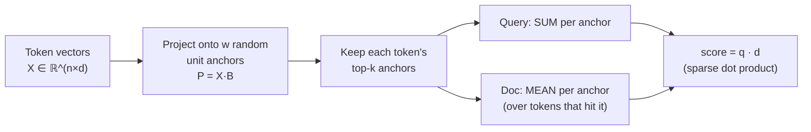

Storage and compute scale with the number of **non-zeros**, not with the width w. That's the whole idea:
*expressive descriptors may need to be large, but not dense.*

**MUVERA** (Google, 2024) does the same with **hard** SimHash buckets and stores a **dense** vector.
The detailed intuition for every method is in [`docs/`](docs/).

---

## 2. Setup

| | |
|---|---|
| **Model** | [BGE-M3](https://arxiv.org/abs/2402.03216): one forward pass gives dense (1024-d), lexical (sparse) and ColBERT (per-token, 1024-d) outputs. Every method uses the same stored vectors. |
| **Datasets** | BEIR test sets, full corpora (below). |
| **Metrics** | nDCG@10, Recall@k, Precision@k, MRR@10, MAP, written from scratch and **verified against `pytrec_eval` to 4 decimals**; BM25 verified against `bm25s`. |
| **Hardware** | Apple M1 Pro, 16 GB. All retrieval timings on **CPU**; BGE-M3 encoding and the cross-encoder on the GPU (MPS, fp16). |
| **Discipline** | Settings for cross-dataset comparisons fixed on SciFact *beforehand*; Jev questions frozen before the full run; paired bootstrap tests on the same queries. |

| dataset | task | docs | test queries | relevant / query | ColBERT vectors |
|---|---|---|---|---|---|
| **SciFact** | evidence for a scientific claim | 5,183 | 300 | ~1 | 1.86 M tokens · 3.8 GB |
| **NFCorpus** | medical papers for a health question | 3,633 | 323 | ~38 (graded) | 1.37 M tokens · 2.8 GB |
| **ArguAna** | the **counter-argument** to an argument | 8,674 | 1,406 (long) | 1 | 4.0 GB + 0.75 GB queries |

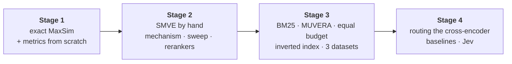

---

## 3. Stage 1: exact MaxSim, the ground truth

Exhaustive MaxSim over all (query, document) pairs, vectorised: all query tokens × a chunk of document tokens in one
matrix product, then `np.maximum.reduceat` (max per document) and `np.add.reduceat` (sum per query) over the ragged
token layout. Document vectors stay memory-mapped; tested against a naive loop.

| SciFact | nDCG | Recall | Precision | MRR | MAP |
|---|---|---|---|---|---|
| @1 | 0.6033 | 0.5705 | 0.6033 | 0.6033 | 0.5705 |
| @10 | **0.6991** | 0.8106 | 0.0913 | 0.6743 | 0.6568 |
| @100 | 0.7232 | **0.9203** | 0.0104 | 0.6786 | 0.6621 |

300 queries × 5,183 docs in **27.6 s** (535 ms for a single query), 3.8 GB index.

<p align="center">
  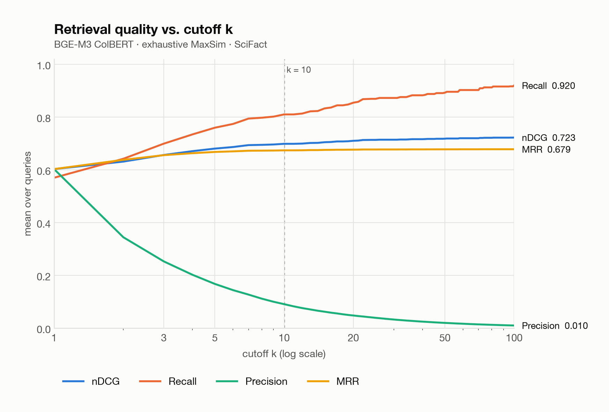
  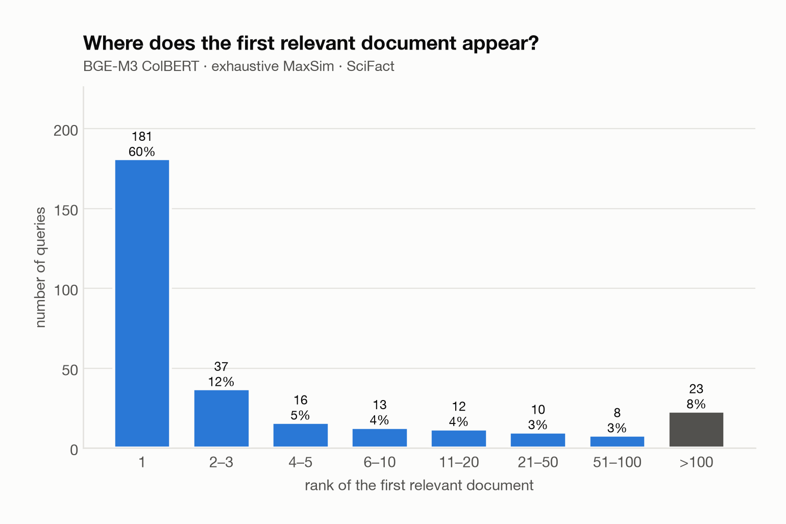
</p>

---

## 4. Stage 2: SMVE by hand

### 4.1 Implementation

Re-implemented from the blog's three steps, then made practical:

- **Memory**: pool straight from the top-k lists (`index_add_`, `bincount`) instead of two dense `tokens × w` scatter matrices per document (117 MB each at w = 65,536).
- **Speed**: encode many documents per projection, merge (item, anchor) pairs with `torch.unique`, output a `scipy` CSR matrix; score with one sparse × sparse product.
- **Correctness**: float32 instead of float16 on CPU; seeded anchors so queries and documents share the same B.
- **Repetitions** (`reps = R`): R blocks of w anchors, top-k *per block*, which equals concatenating R independent SMVE vectors. All verified against the original single-item code.
- **Centering** (`--center on`): BGE-M3 token vectors are anisotropic (two random tokens have cosine 0.29), so a few anchors win for every token. Subtracting the corpus-mean token vector removes the shared direction.

### 4.2 The mechanism: why SMVE loses accuracy (token-pair experiment)

For one query token x and one document token y, SMVE's contribution is
$S(x,y) = \sum_{a \in \text{top}_k(x) \cap \text{top}_k(y)} (x \cdot b_a)(y \cdot b_a)$, against the true cosine x·y. Two failure modes:

- **A, coverage:** no shared anchor, so S = 0 exactly. This is a downward *bias*.
- **B, variance:** how many anchors are shared is random.

Pairs were sampled at controlled cosines (`y = c·x + √(1−c²)·u`), synthetic at d = 128 and 1024 plus real BGE-M3 token pairs, comparing **R repetitions** against **one matrix with R·w anchors and top R·k** at the *same budget*.

<p align="center">
  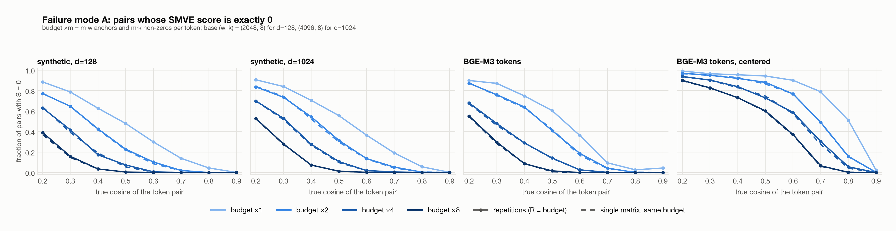
  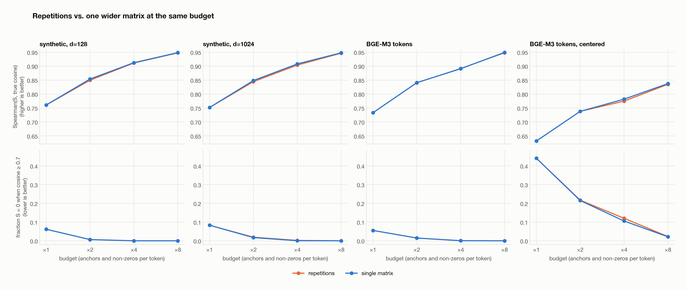
</p>

- **Budget matters a lot, the split doesn't.** Spearman(S, cosine) goes 0.73 → 0.948 from budget ×1 to ×8, but repetitions and one wider matrix are within 0.00–0.007 at every budget (R blocks of random columns are statistically one big random matrix).
- **Failure A is large at small budgets:** at w = 4096, k = 8, **36 %** of real token pairs at cosine 0.6 score exactly 0.
- **Dimension doesn't change the story** (d = 128 ≈ d = 1024).
- **Centering hurts at the pair level** (zero rate for cosine ≥ 0.7 pairs: 5.5 % → 44 %), but helps retrieval (below): its benefit comes from document pooling.

### 4.3 The (w, k, R, centering) sweep: 120 runs

<p align="center">
  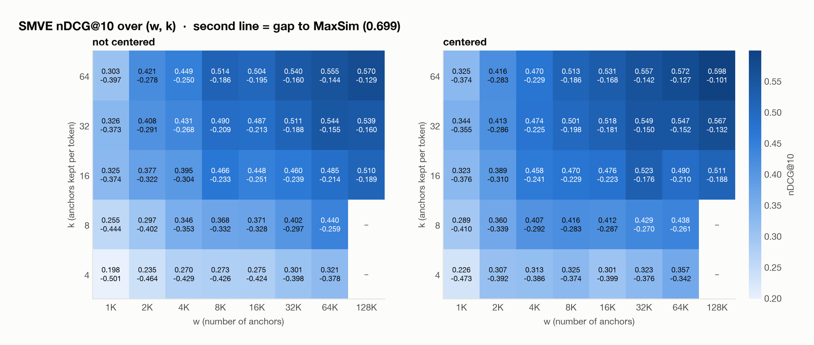
  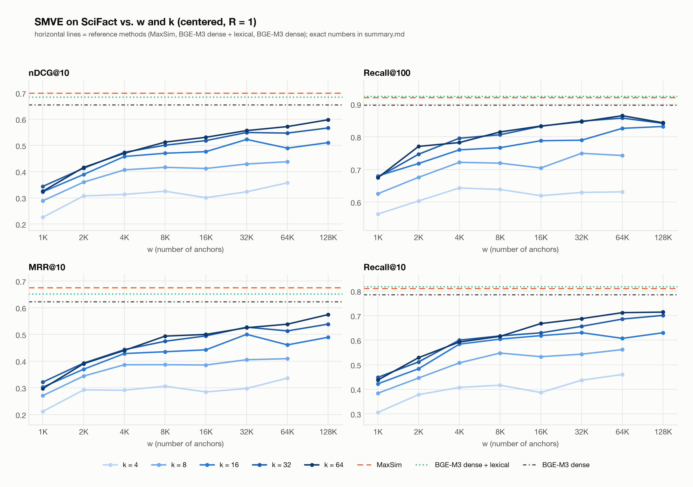
</p>

- **k matters most, then w.** k = 4 plateaus near 0.3; k = 64 is still climbing at w = 128K.
- **Best standalone SMVE: 0.598** (w = 131,072, k = 64, centered), still below dense (0.654).
- **Seed noise ≈ ±0.01** nDCG@10, so differences under ~0.02 aren't meaningful.

<p align="center">
  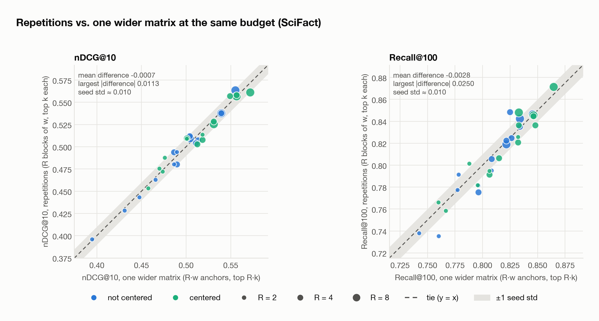
  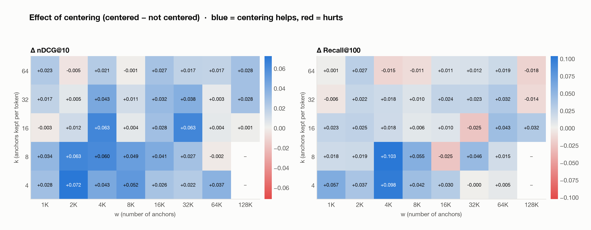
</p>

Repetitions vs one wider matrix in retrieval: **mean Δ −0.0007 nDCG@10, max |Δ| 0.011 across 30 equal-budget pairs**, all within one seed standard deviation. Centering helps most where the budget is small (up to +0.07).

### 4.4 Against simpler single vectors, and with rerankers

| SciFact | nDCG@10 | Recall@100 | single query | index |
|---|---|---|---|---|
| Exhaustive MaxSim | **0.699** | 0.920 | 535 ms | 3.81 GB |
| BGE-M3 dense + 0.3·lexical | 0.684 | **0.924** | 2.9 ms | 27 MB |
| BGE-M3 dense | 0.654 | 0.897 | 0.7 ms | 21 MB |
| BGE-M3 lexical | 0.638 | 0.898 | 2.3 ms | 6 MB |
| SMVE w=65,536 k=32 centered | 0.547 | 0.857 | 87 ms* | 93 MB |

<sub>*before the inverted index of Stage 3b (19 ms after).</sub>

Then a **cross-encoder** (`bge-reranker-v2-m3`, 568 M parameters, ~2.6 × 10¹¹ FLOPs per pair, ~14 pairs/s on MPS) against **MaxSim** as the reranker, at depths 10–100:

<p align="center">
  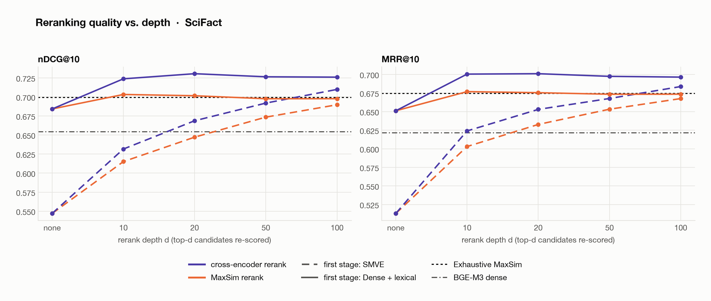
  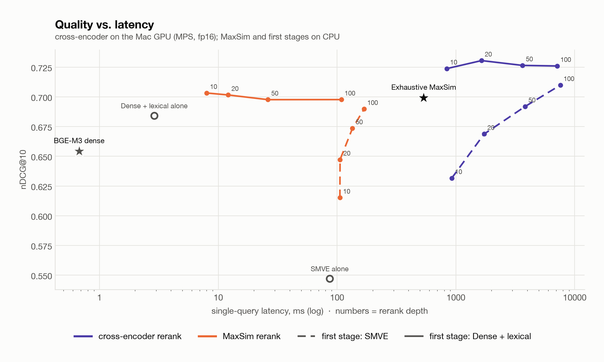
</p>

| pipeline (SciFact) | nDCG@10 | latency | compute / query | storage |
|---|---|---|---|---|
| **dense + lexical → cross-encoder @20** | **0.731** | 1.6 s | 4.9 TFLOP | 1.2 GB (weights) |
| SMVE → cross-encoder @100 | 0.710 | 7.6 s | 26.7 TFLOP | 1.2 GB |
| **dense + lexical → MaxSim @10** | 0.703 | **8 ms** | 0.2 GFLOP | 3.8 GB |
| exhaustive MaxSim | 0.699 | 535 ms | 100 GFLOP | 3.8 GB |
| SMVE → MaxSim @100 | 0.690 | 169 ms | 5.6 GFLOP | 3.9 GB |

The first stage decides how deep you must rerank: with dense + lexical the relevant documents are already near the
top (quality peaks at depth 10–20); with SMVE quality keeps rising to depth 100, costing ~4.6× more for less.

---

## 5. Stage 3: the alternatives, real latency, more datasets

Full walkthrough: [`docs/stage3_explained.md`](docs/stage3_explained.md).

### 5.1 BM25, MUVERA, and equal budget

- **BM25**, hand-written (Snowball stemming, stop words, k1 = 1.2, b = 0.75), matches `bm25s`; **0.690** nDCG@10 on SciFact at 0.13 ms.
- **MUVERA**, implemented from the paper (SimHash buckets, ±1 projection, fill-empty-buckets, repetitions) and tested against a naive implementation; 54 settings.

<p align="center">
  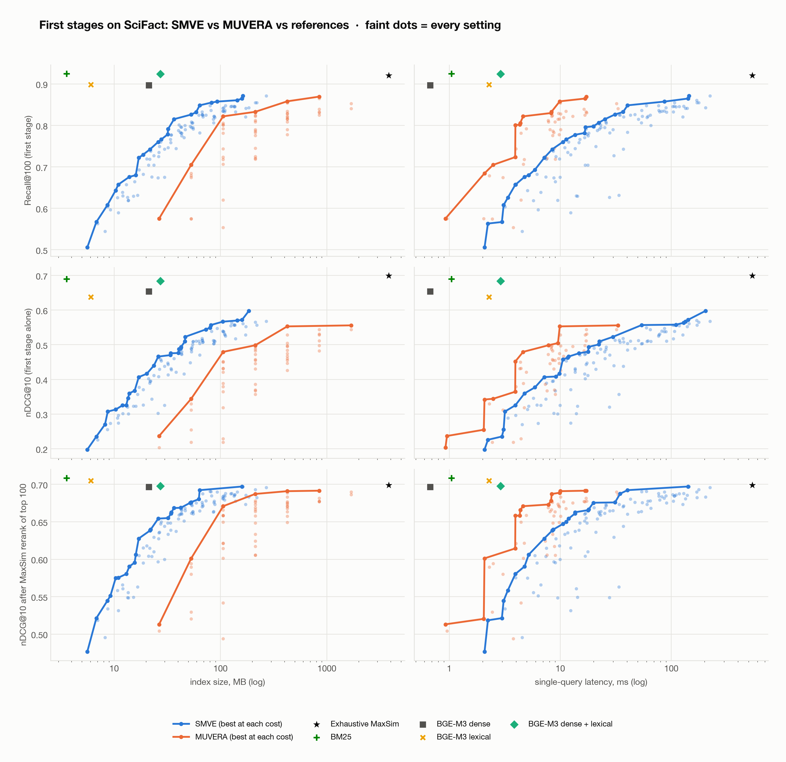
</p>

| SciFact, equal budget | SMVE best | MUVERA best |
|---|---|---|
| index ≤ 100 MB · Recall@100 | **0.857** | 0.705 |
| index ≤ 100 MB · nDCG@10 after MaxSim@100 | **0.692** | 0.601 |
| latency ~10–20 ms · Recall@100 (Stage-3b timings) | 0.857 | 0.869 |

| first stage → MaxSim rerank of top 100 | nDCG@10 (SciFact) |
|---|---|
| **BM25 → MaxSim** | **0.709** |
| exhaustive MaxSim (no first stage) | 0.699 |
| best SMVE → MaxSim | 0.697 |
| best MUVERA → MaxSim | 0.692 |

BM25 and MaxSim make *different* mistakes, so BM25 filters out MaxSim's "false friends". SMVE and MUVERA copy
MaxSim, so after MaxSim reranking they can at best recover MaxSim itself.

### 5.2 A hand-built inverted index

Posting lists = the CSC layout of the document matrix; exhaustive term-at-a-time scoring with vectorised gathering
(`ragged_ranges` + `np.bincount`). Scores identical to the sparse matrix product.

<p align="center">
  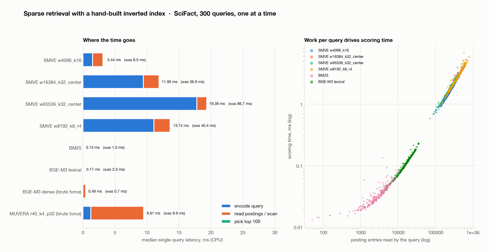
</p>

| one query, CPU | total | encode query | search | postings read |
|---|---|---|---|---|
| SMVE w=65,536 k=32 centered | **19.4 ms** (was 86.7) | **17.8** | 1.6 | **216 K** |
| SMVE w=4,096 k=16 | 3.4 ms | 1.5 | 1.6 | 256 K |
| MUVERA r40 k4 p32 (brute force) | 9.6 ms | 1.2 | 8.3 | n/a |
| BM25 | 0.13 ms | 0.04 | 0.04 | 3.8 K |
| BGE-M3 dense (brute force) | 0.49 ms | 0 | 0.43 | n/a |

- **The bottleneck is query encoding**, not search: projecting ~26 query tokens onto a 1024 × 65,536 anchor matrix reads **268 MB** per query (17.7 ms). Half-precision anchors, a GPU, or structured random projections would attack this.
- **SMVE queries are long** (~450 non-zero anchors vs 9 BM25 terms) and pick *popular* anchors, so they read ~58× more postings than BM25. Postings grow with corpus size, and dynamic pruning (WAND/MaxScore) is least effective on long queries. **This is SMVE's main open scaling question.**

### 5.3 Three datasets and headroom

$$\text{headroom} = \text{nDCG@10}(\text{exhaustive MaxSim}) - \text{nDCG@10}(\text{dense})$$

| nDCG@10 | SciFact | NFCorpus | ArguAna |
|---|---|---|---|
| Exhaustive MaxSim | **0.699** | **0.344** | 0.484 |
| BM25 | 0.690 | 0.328 | 0.492 |
| BGE-M3 dense | 0.654 | 0.317 | **0.527** |
| BGE-M3 dense + lexical | 0.684 | 0.329 | 0.499 |
| SMVE (setting fixed on SciFact) | 0.547 | 0.223 | 0.378 |
| MUVERA (setting fixed on SciFact) | 0.553 | 0.260 | 0.426 |
| **headroom (MaxSim − dense)** | **+0.045** | **+0.028** | **−0.042** |

MaxSim *loses* to dense on ArguAna: it sums ~200 query-token matches, mostly generic words, which drown the few that
matter for "find the counter-argument". ArguAna's self-matches are removed as in BEIR; NFCorpus uses graded relevance.

<details>
<summary><b>Recall@100 and post-rerank tables</b></summary>

| Recall@100 | SciFact | NFCorpus | ArguAna |
|---|---|---|---|
| Exhaustive MaxSim | 0.920 | 0.291 | 0.967 |
| BM25 | 0.925 | 0.257 | 0.973 |
| BGE-M3 dense | 0.897 | 0.283 | 0.982 |
| BGE-M3 dense + lexical | 0.924 | 0.289 | 0.988 |
| SMVE (fixed) | 0.857 | 0.211 | 0.924 |
| MUVERA (fixed) | 0.858 | 0.238 | 0.950 |

| nDCG@10 after MaxSim rerank of top 100 | SciFact | NFCorpus | ArguAna |
|---|---|---|---|
| BM25 → MaxSim | **0.709** | 0.343 | **0.488** |
| dense + lexical → MaxSim | 0.698 | 0.342 | 0.485 |
| SMVE (fixed) → MaxSim | 0.690 | 0.318 | 0.484 |
| MUVERA (fixed) → MaxSim | 0.689 | 0.326 | 0.484 |
| exhaustive MaxSim | 0.699 | 0.344 | 0.484 |

Full tables: [`results/cross_dataset/summary.md`](results/cross_dataset/summary.md).
</details>

---

## 6. Stage 4: when is the expensive reranker worth it? (Jev router)

Full walkthrough: [`docs/stage4_explained.md`](docs/stage4_explained.md).

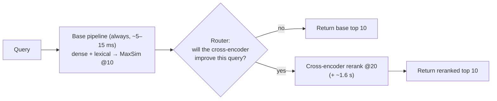

### 6.1 Is routing worth it? The oracle

| 2,838 queries | SciFact | NFCorpus | ArguAna |
|---|---|---|---|
| never escalate | 0.703 | 0.332 | 0.498 |
| always escalate (1.6 s each) | 0.731 | 0.342 | **0.698** |
| **oracle router** | **0.764** | **0.364** | **0.739** |
| queries where escalation helps | 19 % | 32 % | 53 % |

The oracle is *better* than always escalating (the cross-encoder sometimes hurts) while escalating only 19–53 % of queries.

### 6.2 Baseline routers (first-stage score features)

Logistic regression and boosted trees on 16 first-stage signals (score margins, dense/lexical agreement, query length),
under **pooled 5-fold CV** and **train-on-SciFact → test elsewhere** transfer.

<p align="center">
  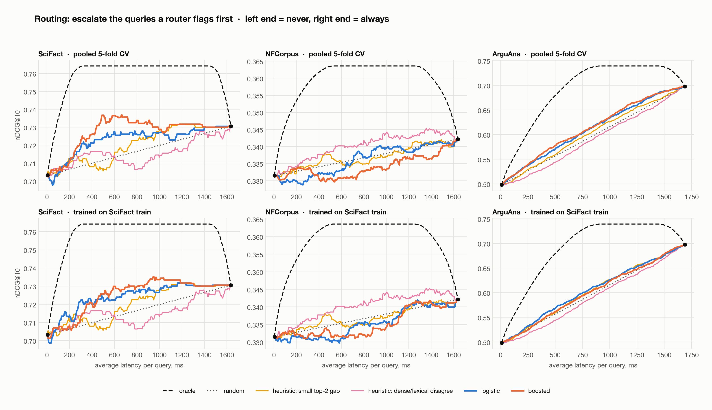
</p>

Best AUC: 0.77 (SciFact), 0.59 (NFCorpus), 0.63 (ArguAna); ~15–25 % of the oracle's gain. On SciFact, escalating the
boosted router's top 30 % gives **0.737 at ~0.5 s/query**, better than always escalating at 1.6 s. Transfer to
ArguAna fails (AUC 0.52, ECE 0.33).

### 6.3 Jev as the router

[Jev](https://typesafe.ai/blog/introducing-system-one-models-and-jev) (`jev-1.13.0`) answers typed yes/no questions
with calibrated probabilities in ~130 ms. It saw either the **query only** (runs in parallel with the first stage) or the
**query + top-3 candidates**, with atomic questions designed around its documented weak spots (no numbers, explicit
criteria, short state). Questions and zero-shot directions were fixed before the full run; Jev's latency is charged to
every query. 2,838 queries × 2 calls cost **$0.23**.

<p align="center">
  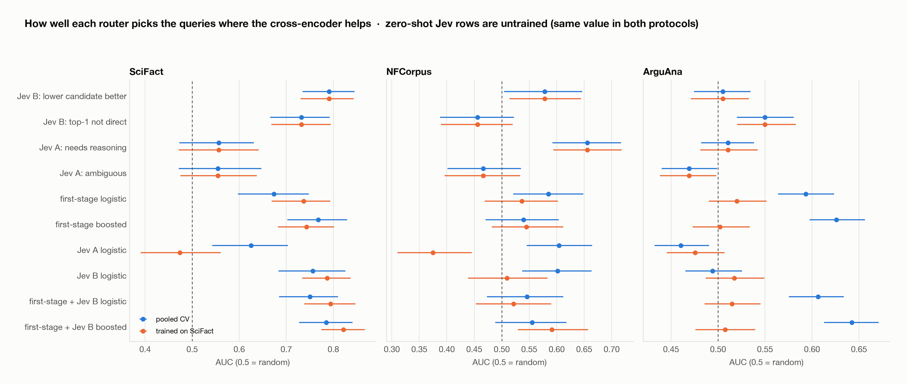
</p>

| router (AUC) | training | SciFact | NFCorpus | ArguAna |
|---|---|---|---|---|
| best first-stage-feature router | yes | 0.77 | 0.59 | **0.63** |
| **Jev: "a lower candidate is better"** | **none** | **0.79** | 0.58 | 0.51 |
| **Jev: "the query needs reasoning"** | **none** | 0.56 | **0.66** | 0.51 |
| first-stage + Jev, trained on SciFact | yes | **0.82** | 0.59 | 0.51 |

| paired bootstrap (same queries) | ΔAUC [95 % CI] | p |
|---|---|---|
| SciFact: Jev zero-shot − best trained router | +0.023 [−0.051, +0.099] | 0.54 (tie, no training) |
| SciFact: first-stage + Jev − first-stage (SciFact-trained) | **+0.078 [+0.036, +0.121]** | **0.001** |
| NFCorpus: Jev "needs reasoning" − best feature router | +0.070 [−0.011, +0.151] | 0.08 |
| ArguAna: Jev zero-shot − best trained router | −0.121 [−0.160, −0.081] | < 0.001 |

<p align="center">
  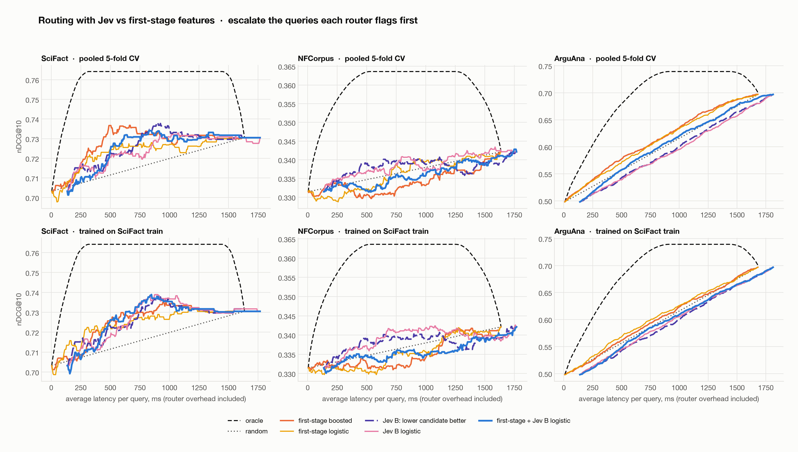
</p>

- **Jev reads what score features can't**: zero-shot it matches a trained router on SciFact, and it significantly improves one when combined.
- **ArguAna resists every router**, where the cross-encoder matters most (+0.20). There, always escalate.
- **Calibration has a catch**: Jev is calibrated for *its* question, not for "will the cross-encoder help?". Raw answers have ECE 0.10–0.35; a small trained model fixes that within a dataset, but not across datasets.

### 6.4 Jev as the reranker itself

If Jev can judge which candidate is better, can it *replace* the cross-encoder? Same first stage, same top 20, on all
2,029 test queries, with three ways of asking (wording fixed before any results; task lines are the standard
[E5-mistral](https://arxiv.org/abs/2401.00368) per-dataset instructions):

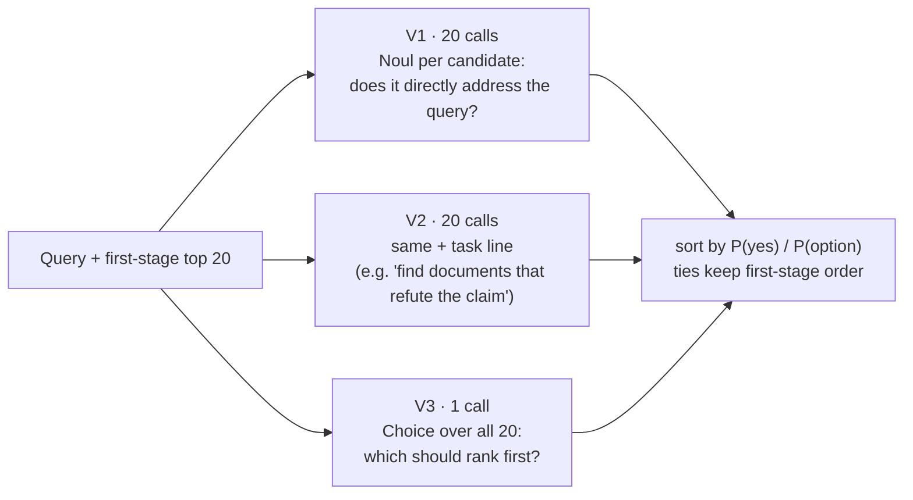

<p align="center">
  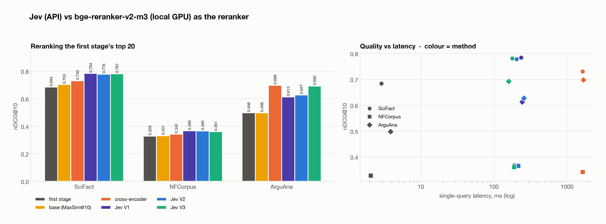
</p>

| nDCG@10, rerank top 20 | SciFact (300) | NFCorpus (323) | ArguAna (1,406) | one query |
|---|---|---|---|---|
| first stage only | 0.684 | 0.328 | 0.498 | ~3 ms |
| cross-encoder `bge-reranker-v2-m3` (laptop GPU) | 0.731 | 0.342 | **0.698** | ~1,630 ms |
| **Jev V1** · per pair, generic | **0.784** | **0.366** | 0.614 | 193–244 ms |
| **Jev V2** · per pair, + task | 0.778 | 0.366 | 0.628 | 204–258 ms |
| **Jev V3** · one Choice per query, + task | 0.781 | 0.361 | 0.692 | **159–188 ms** |

| Jev − cross-encoder (paired, 95 % CI) | SciFact | NFCorpus | ArguAna |
|---|---|---|---|
| V1 | **+0.053** [+0.031, +0.076] | **+0.024** [+0.014, +0.034] | −0.084 [−0.100, −0.068] |
| V2 | **+0.047** [+0.025, +0.069] | **+0.024** [+0.014, +0.033] | −0.070 [−0.088, −0.053] |
| V3 | **+0.051** [+0.027, +0.074] | **+0.019** [+0.009, +0.029] | −0.006 [−0.022, +0.011] |

- **On SciFact and NFCorpus, Jev is the best reranker tested**, significantly, for every variant.
- **ArguAna needs comparison, not isolated scoring.** Even told the task, per-pair Jev can't single out *the* counter-argument among other disagreeing arguments. Seeing all 20 at once (V3) recovers a tie.
- **V3 is the practical choice**: one request per query, fastest, ~half the tokens, never significantly worse than the cross-encoder. Per-pair variants need 20 requests per query against a 40 req/s rate limit.
- **A cautionary pilot**: on 50 queries V3 looked +0.07 ahead on ArguAna; on all 1,406 it's −0.006.
- **Caveat**: the latency comparison is hardware, not method: the cross-encoder ran on a laptop GPU, Jev on TypeSafe's servers. Neither model's training data can be ruled out from overlapping these public datasets. Full run cost: **$3.24**.

---

## 7. Conclusions

**On SMVE (with BGE-M3, on these datasets):**

- Its strengths are **engineering**: a compact sparse index (~5× smaller than MUVERA at equal recall), inverted-index serving, and no training or clustering.
- Its quality is capped by **headroom over dense**, which is small or negative here.
- Our results agree with [TopK's](https://www.topk.io/blog/20260311-smve-multi-vector-retrieval) use of SMVE as a *first stage* followed by MaxSim: SMVE → MaxSim reaches 0.690 vs MaxSim 0.699 on SciFact. But a dense + lexical (or BM25) first stage did the same job better and cheaper. The decision rule set before Stage 3:

  | criterion | verdict |
  |---|---|
  | (a) beats MUVERA at equal budget | **partly** (storage yes, latency tie, worse on 2/3 datasets at the SciFact-chosen setting) |
  | (b) beats dense + lexical → MaxSim where headroom is large | **untestable here**: no dataset had large headroom |

**Lessons for any retrieval project:**

1. Measure **headroom** before optimising an approximation of an expensive method.
2. Compare at **equal cost**, and measure cost with the right data structure (our first SMVE timings were 4.5× too slow).
3. A first stage should **complement** its reranker (BM25 → MaxSim), not imitate it.
4. Check the **oracle** before building a router.
5. Fix settings and questions **before** looking at test results; use **paired** tests on the same queries.

**On reranking:** a fast decision model (Jev) reranked better than a dedicated cross-encoder on two of three datasets,
and tied it on the third once it could compare candidates side by side. The best overall pipelines we found are
**dense + lexical → Jev V3 rerank** (quality) and **BM25 / dense + lexical → MaxSim** (cost).

**Natural next steps:** ColBERT-only models without a strong dense head (ColBERTv2, ModernColBERT), where SMVE's
headroom should be larger; Jev reranking with deeper candidate lists and a cross-encoder on server-class hardware for a
fair latency comparison; faster SMVE query encoding (fp16 / structured anchors); dynamic pruning for long SMVE queries
at million-document scale.

---

## 8. Limitations

- **One encoder.** Everything uses BGE-M3, whose dense vector is unusually strong relative to its ColBERT output. TopK evaluated SMVE with ColBERTv2.
- **Small corpora** (3.6K–8.7K documents). Scaling behaviour (postings, pruning, ANN for MUVERA) is extrapolated, not measured.
- **Laptop timings.** CPU on an M1 Pro, single query at a time; production kernels and hardware differ. Jev latency includes the network round trip.
- **Mostly one seed** per SMVE/MUVERA setting (seed noise measured at ±0.005–0.02 nDCG@10 for key settings).
- **Exhaustive** (unpruned) inverted index; real engines would read fewer postings for short queries.
- **Routing labels** use nDCG@10 changes, which are coarse for single-relevant-document datasets (many ties).
- **Reranker latency** compares a laptop GPU (cross-encoder) with a hosted API (Jev); only the quality comparison is like for like. Jev's training data is undisclosed.

---

## 9. Reproduce

Requires Python ≥ 3.12 and [uv](https://docs.astral.sh/uv/). Embeddings (~14 GB) and large run files are not tracked; they're regenerated.

```bash
git clone https://github.com/ujwal-jibhkate/smve-lab.git && cd smve-lab
uv sync
uv run pytest -q                                   # 24 tests, a few seconds
```

<details>
<summary><b>Stage 1–2 (SciFact)</b></summary>

```bash
uv run python scripts/encode_scifact.py                 # BGE-M3 embeddings (~15 min on MPS)
uv run python scripts/evaluate_maxsim.py                # exhaustive MaxSim (~30 s)
uv run python scripts/evaluate_bgem3_single_vector.py   # dense / lexical / hybrid
uv run python scripts/evaluate_smve.py --center off on  # SMVE, notebook setting
uv run python scripts/smve_mechanism.py                 # token-pair mechanism study (minutes)
uv run python scripts/evaluate_smve.py --light --skip-existing --center off on \
    --w 1024 2048 4096 8192 16384 32768 65536 --k 4 8 16 32 64   # sweep (hours)
uv run python scripts/plot_smve_sweep.py                # sweep report + plots
uv run python scripts/evaluate_rerank.py                # cross-encoder vs MaxSim rerank (~1 h, MPS)
uv run python scripts/compare_runs.py                   # comparison report
```
</details>

<details>
<summary><b>Stage 3 (alternatives, latency, more datasets)</b></summary>

```bash
uv run python scripts/evaluate_bm25.py
uv run python scripts/evaluate_muvera.py --reps 10 20 40 --k-sim 4 5 6 --d-proj 8 16 32 --center off on --light
uv run python scripts/compare_first_stages.py           # equal-budget report
uv run python scripts/evaluate_inverted_index.py        # real query latency

uv run python scripts/encode_beir.py --dataset nfcorpus
uv run python scripts/encode_beir.py --dataset arguana
bash scripts/run_all_methods.sh nfcorpus
bash scripts/run_all_methods.sh arguana
uv run python scripts/cross_dataset_summary.py
```
</details>

<details>
<summary><b>Stage 4 (routing, Jev)</b></summary>

```bash
uv run python scripts/build_router_data.py              # labels + features (~1 h cross-encoder on MPS)
uv run python scripts/router_baselines.py               # oracle / random / logistic / boosted

echo "TYPESAFE_API_KEY=..." > .env                      # git-ignored
uv run python scripts/jev_router.py --pilot 50          # optional pilot
uv run python scripts/jev_router.py                     # all queries (~$0.23, cached)
uv run python scripts/evaluate_jev_router.py            # Jev vs baselines + paired tests

uv run python scripts/jev_rerank.py --pilot 50          # Jev as the reranker: pilot (~$0.25)
uv run python scripts/jev_rerank.py --latency-queries 10   # full run (~$3, cached) + live latency probe
```
</details>

Every script has `--help`; long runs are resumable (`--skip-existing`, on-disk caches for cross-encoder and Jev
responses). Keep the laptop awake for multi-hour runs (`caffeinate -is <cmd>` on macOS).

---

## 10. Repository layout

```
smve-lab/
├── src/smve_lab/
│   ├── maxsim.py            exact MaxSim (vectorised reduceat, query/doc chunking)
│   ├── smve.py              SMVE encoder: anchors, top-k per block, pooling, centering
│   ├── muvera.py            MUVERA fixed dimensional encodings
│   ├── bm25.py              BM25 from scratch
│   ├── inverted_index.py    posting lists + term-at-a-time scoring
│   ├── reranker.py          bge-reranker-v2-m3 cross-encoder wrapper
│   ├── jev.py               cached, parallel TypeSafe Jev client
│   ├── metrics.py           nDCG / Recall / Precision / MRR / MAP (pytrec_eval-verified)
│   ├── evaluation.py        shared rank → evaluate → save → plot step
│   ├── datasets.py          SciFact / NFCorpus / ArguAna loading, paths, quirks
│   ├── bge_m3.py · storage.py · config.py · plots.py
├── scripts/                 one script per experiment (see §9)
├── results/
│   ├── <dataset>_bgem3/     per-method summary.json, per_query.csv, metrics_at_k.csv, plots/
│   ├── smve_mechanism/      token-pair study
│   ├── cross_dataset/       all methods × all datasets, headroom
│   ├── router/              routing data, baselines, Jev answers and reports
│   └── jev_rerank/          Jev vs cross-encoder as the reranker
├── docs/                    plain-language explainers with the maths and intuition
│   ├── repetitions_explained.md
│   ├── stage3_explained.md
│   └── stage4_explained.md
└── tests/                   unit tests (MaxSim, SMVE, MUVERA, BM25, inverted index, metrics, storage)
```

---

## 11. References

- Khattab & Zaharia, *ColBERT: Efficient and Effective Passage Search via Contextualized Late Interaction over BERT*, 2020. [arXiv:2004.12832](https://arxiv.org/abs/2004.12832)
- Chen et al., *BGE M3-Embedding: Multi-Lingual, Multi-Functionality, Multi-Granularity*, 2024. [arXiv:2402.03216](https://arxiv.org/abs/2402.03216)
- TopK, *SMVE: Multi-Vector Retrieval That Just Works*, 2026. [topk.io blog](https://www.topk.io/blog/20260311-smve-multi-vector-retrieval) · [benchmarks](https://www.topk.io/benchmarks)
- Dhulipala et al., *MUVERA: Multi-Vector Retrieval via Fixed Dimensional Encodings*, 2024. [arXiv:2405.19504](https://arxiv.org/abs/2405.19504)
- Santhanam et al., *PLAID: An Efficient Engine for Late Interaction Retrieval*, 2022. [arXiv:2205.09707](https://arxiv.org/abs/2205.09707)
- Formal et al., *SPLADE: Sparse Lexical and Expansion Model for First Stage Ranking*, 2021. [arXiv:2107.05720](https://arxiv.org/abs/2107.05720)
- Thakur et al., *BEIR: A Heterogeneous Benchmark for Zero-shot Evaluation of Information Retrieval Models*, 2021. [arXiv:2104.08663](https://arxiv.org/abs/2104.08663)
- Mu & Viswanath, *All-but-the-Top: Simple and Effective Postprocessing for Word Representations*, ICLR 2018. [arXiv:1702.01417](https://arxiv.org/abs/1702.01417)
- TypeSafe, *Introducing System One Models & Jev*, 2026. [typesafe.ai blog](https://typesafe.ai/blog/introducing-system-one-models-and-jev) · [docs](https://docs.typesafe.ai/)
- BAAI, [`bge-reranker-v2-m3`](https://huggingface.co/BAAI/bge-reranker-v2-m3)
- Wang et al., *Improving Text Embeddings with Large Language Models* (E5-mistral; source of the per-dataset task instructions), 2024. [arXiv:2401.00368](https://arxiv.org/abs/2401.00368)
