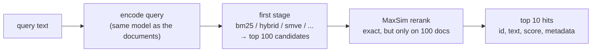
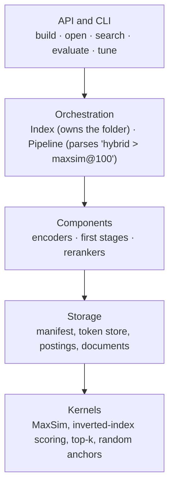

# The library design explained simply: from smve-lab to a pip package

We want to turn what we learned in smve-lab into a Python library that anyone can install and use to
search their own documents locally:

> `pip install <name>` → point it at your documents → get good search results,
> with the best settings we measured already chosen for you.

> **Update, 2026-10-05:** the library is now being built as **`laterank`** at
> [github.com/ujwal-jibhkate/laterank](https://github.com/ujwal-jibhkate/laterank). The decisions in
> section 12 were taken as recommended: name `laterank`, a new repo, Apache-2.0, and add/delete moved
> to 0.2. The default model will be chosen from M1 measurements. Below, `mvr` is the old
> placeholder name.

The full, detailed design document lives here:
**[Local Late-Interaction Retrieval Library — Design Document](https://claude.ai/code/artifact/68fd7c6e-0886-4fb3-9e05-ea25d0693c2e)**.
This note explains the same design in plain language: what each part is, and **why** we chose it.

---

## 1. The one-paragraph version

The library takes your documents, turns them into vectors once (with BGE-M3 or a ColBERT model), and
saves everything in a folder. When you search, it first finds about 100 promising documents with a
**cheap first stage**, then re-orders them with **exact MaxSim**, the accurate but expensive scoring
we studied in stage 1. You can swap the first stage (BM25, dense, hybrid, SMVE, MUVERA) or the
reranker by name, measure any pipeline on your own data, and let the library pick settings for a
speed or size budget.

---

## 2. Why it is *not* "the SMVE package"

This was the most important decision, and our own results made it:

| what we measured | number |
|---|---|
| Standalone SMVE vs a plain dense vector (nDCG@10) | SMVE is **0.09–0.15 worse** on all 3 datasets |
| Hybrid first stage + MaxSim on the top 10 | **0.703** in 8 ms (exhaustive MaxSim: 0.699 in 535 ms) |
| After MaxSim on the top 100 | **every** first stage ends up within 0.026 of exhaustive MaxSim |
| BM25 + MaxSim on the top 100 | best or tied on all 3 datasets |

So if the library pushed SMVE as *the* answer, it would be recommending something our data says is
not the best default. Instead:

- The **default** is what won: `hybrid > maxsim@100` for BGE-M3, and `bm25 > maxsim@100` for ColBERT
  models (which have no dense or lexical head).
- **SMVE is a first-class option**, useful where it really shines: at equal storage it beats MUVERA
  clearly (Recall@100 0.857 vs 0.705 under 100 MB).
- SMVE is **TopK's method**. We credit them by name everywhere and contact them before releasing.

---

## 3. How one search works



Why two stages? MaxSim compares every query token with every document token. Doing that against the
whole corpus is slow (535 ms on SciFact). Doing it against 100 candidates is cheap, and our stage 3
results showed that the right 100 candidates almost always contain what exhaustive MaxSim would have
put in its top 10.

We write a pipeline as a short string, the same everywhere (Python, the CLI, saved files):

```text
hybrid > maxsim@100                       default for BGE-M3
bm25 > maxsim@100                         default for ColBERT models
smve(preset=quality) > maxsim@50 > cross-encoder@20
exhaustive                                exact MaxSim over everything (for checking)
```

Read `>` as "then", and `@100` as "rerank the top 100".

---

## 4. What a user actually types

**Someone who just wants search** never chooses a method:

```python
import mvr                                   # "mvr" is a placeholder name, see section 9

docs = mvr.load("./notes/")                  # a folder, a .jsonl file, or a list of strings
index = mvr.build(docs, path="./notes_index")
for hit in index.search("statin side effects", k=5):
    print(hit.rank, hit.score, hit.id)
```

**Someone with a budget** asks the library to choose:

```python
report = index.tune(budget=mvr.Budget(latency_ms=20))
index.set_default(report.best)
```

**A researcher** compares pipelines on BEIR, which is our whole stage 3 in a few lines:

```python
ds = mvr.datasets.beir("scifact")
index = mvr.build(ds.corpus, model="bge-m3", path="./scifact",
                  first_stages=["bm25", "hybrid", "smve", "muvera"])
index.evaluate(ds, pipelines=["hybrid", "smve", "hybrid > maxsim@10"]).table()
```

The CLI does the same things: `mvr build`, `mvr search`, `mvr eval`, `mvr tune`.

---

## 5. How the code is organised (five layers)



The rule: **imports only point down**. A kernel never knows which model made its vectors, and storage
never knows which method reads it. Two good consequences:

1. **Kernels are easy to test.** They are pure functions on arrays, so we check them against slow,
   obvious loops (exactly like `tests/test_maxsim.py` does today).
2. **The bottom two layers need only numpy and scipy, not torch.** torch, FlagEmbedding and
   sentence-transformers are loaded only inside the components that need them. `pip install mvr`
   stays small; models come with extras like `pip install "mvr[bge-m3]"`.

Most of the code already exists in `src/smve_lab/`. `maxsim.py`, `smve.py`, `muvera.py`, `bm25.py`,
`inverted_index.py`, `metrics.py` and `storage.py` move into these layers with small changes. The
detailed design has a table of exactly what moves where.

---

## 6. What gets saved on disk, and why it matters

An index is just a folder:

```text
notes_index/
  manifest.json        the "recipe card": model + exact version, settings, default pipeline
  seg-000001/
    docs.jsonl         the documents (id, text, metadata)
    tokens/flat.npy    every token vector, float16, opened with mmap
    dense/ lexical/ bm25/ smve-balanced/ ...   one folder per first stage
```

Three ideas to remember:

- **The manifest is a recipe card.** `mvr.open("./notes_index")` reads it and knows the model, the
  model's exact Hugging Face revision, every setting and the default pipeline. You never re-type them.
  This also prevents a nasty bug: encoding queries with a *different* model version than the
  documents.
- **No pickles.** Everything is `.npy` arrays and JSON, so any tool can read it, and opening a file
  can't run hidden code. (RAGatouille's indexes were 13 PyTorch pickle files, which we want to avoid.)
- **mmap.** The token vectors are 3.8 GB for SciFact with BGE-M3. With memory-mapping, opening the
  index costs almost no RAM; MaxSim only pages in the ~100 documents it reranks.

**Adding documents later** writes a new "segment" folder instead of rebuilding everything. That works
because almost every representation of a document depends only on that document. BM25 is the
exception, since IDF depends on the whole corpus. So we store raw term counts and compute BM25 weights
at query time from global statistics.

---

## 7. The random anchors problem (a subtle one)

SMVE needs the **same** random anchor matrix B every time the index is opened, or new queries stop
matching the stored documents. smve-lab used `torch.Generator`, but torch doesn't promise that the same
seed gives the same numbers in a future torch version.

The fix: the library generates anchors with its own ~20-line random generator (SplitMix64 +
Box–Muller in numpy), so B depends only on `(seed, d, w)`, forever. The manifest stores a hash of B,
and `open` checks it.

Side effect: the library's SMVE numbers won't match smve-lab **bit for bit**, only statistically. That
is fine, because smve-lab already showed how much SMVE moves between seeds (up to 0.038 nDCG@10). The
tests check that the library lands inside that range.

---

## 8. `tune`: choosing settings without any labels

This is the most original part, so here is the idea step by step.

**Problem:** a user's own documents have no relevance labels (no qrels), so they can't compute nDCG.

**Trick:** for the two-stage pipeline, **exact MaxSim is the answer key**. The cheap pipeline is
trying to reproduce what exhaustive MaxSim would return. So:

1. Make some queries. Use the user's real ones, or cut a random 8–24-word span out of a document (and
   ignore that source document, so it can't trivially find itself).
2. Run exhaustive MaxSim once per query → its top 10 is the "answer key".
3. For each candidate setting (e.g. SMVE w=65,536 k=32, rerank depth 50), check what fraction of
   MaxSim's top 10 appears in the first stage's top 50. Because the MaxSim rerank is exact, that
   fraction **is** the overlap of the final top 10 with the answer key.
4. Among settings within the budget (milliseconds or MB), pick the one with the highest overlap.

**The honest catch:** "agrees with MaxSim" is not the same as "finds relevant documents". Before
release we test it on our three datasets: does tune (no labels) pick nearly the same setting as real
qrels would (within 0.01 nDCG@10)? If not, we ship tune with labels as the recommended mode and say so.

---

## 9. What we learned from other libraries

| library | lesson we took |
|---|---|
| **Sentence Transformers v6** (`MultiVectorEncoder`, Aug 2026) | Loads every common ColBERT checkpoint with its own prefixes, query expansion and punctuation rules. We use it for ColBERT models instead of re-implementing those rules. |
| **PyLate** | Owns training and PLAID indexes. We don't compete with it on scale. |
| **NextPlaid** | A fast local multi-vector engine. Good ideas for later (add/delete, metadata filters). |
| **RAGatouille** | Strong defaults are great; pickle files, no Windows support and a single maintainer are what to avoid. |
| **bm25s** | Tiny install, mmap, a one-line high-level API on top of composable pieces, and a CLI that mirrors Python. |
| **rerankers** | Results should be plain, transparent objects (id, text, score, rank, metadata). |

**Where we fit:** use PyLate to *train* a model, NextPlaid or a vector database to *serve* millions of
documents, and this library to **find out which pipeline is right for your corpus**, run it locally,
and reproduce our experiments.

**About the name:** `mvr` was only a placeholder ("multi-vector retrieval"), and it is already taken
on PyPI by an unrelated package. The design doc recommends **`laterank`** (free on PyPI as of
2026-10-03). Other free options: `latesearch`, `maxsim`, `tokenmatch`, `pylir`.

---

## 10. How we make sure it's correct

- **Kernels** are tested against naive loops, plus "property" tests. For example, MaxSim must not
  change if you shuffle a document's tokens, and must never drop if you add a token.
- **Metrics** are tested against pytrec_eval, and **BM25** against bm25s.
- **Golden tests** re-run our smve-lab pipelines on the stored embeddings, and the numbers must match
  within ±0.002 nDCG@10. For example: SciFact `hybrid > maxsim@100` = 0.6977 and BM25 = 0.6896 (with
  the old ASCII tokenizer).
- **CI** runs on macOS, Linux and Windows, with real models and full datasets tested nightly.

---

## 11. The plan

| when (2026) | milestone | done means |
|---|---|---|
| Oct 5 – 9 | M0 foundations | repo, CI, kernels and storage ported, golden harness |
| Oct 12 – 23 | M1 methods + measurements | all stages; presets measured for small ColBERT models; golden tests pass |
| Oct 26 – 30 | M2 evaluate + tune | tune validated against real labels |
| Nov 2 – 6 | M3 usability | CLI, chunking, add/delete |
| Nov 9 – 13 | M4 docs + beta | docs site, `0.1.0b1` on PyPI |
| Nov 16 – 27 | beta testing | outside users try it |
| Nov 30 | **0.1.0** | released |

This is longer than the "2–3 weeks" from our first chat. That estimate was only for moving the code;
this plan also includes the measurements, the tune validation, the docs and release hardening.

---

## 12. Decisions waiting for you

1. **Name**: `laterank` (recommended) or another free one.
2. **Default model**: keep BGE-M3, or switch to a small ColBERT model if M1 shows it is within 0.02
   nDCG@10? A 64-d ColBERT model's token store is about 19× smaller per document (≤ 38 KB vs 735 KB).
3. **New repo** for the library, keeping smve-lab as the research record: recommended.
4. **License**: Apache-2.0 (recommended) or MIT.
5. **Scope**: moving add/delete to 0.2 would save about a week.

---

## Glossary

- **First stage**: a fast method that picks candidates from the whole corpus (BM25, dense, hybrid,
  SMVE, MUVERA).
- **Rerank / depth**: re-score only the top-`depth` candidates with a slower, better method.
- **MaxSim**: for each query token, take its best-matching document token, then sum. Accurate, slow
  over a whole corpus.
- **Token store**: every token vector of every document, needed for MaxSim.
- **Manifest**: the JSON "recipe card" that describes an index.
- **mmap**: reading a file as if it were in memory, without loading all of it.
- **Segment**: one batch of documents added at one time; an index is a list of segments.
- **Preset**: a named group of settings (e.g. SMVE `balanced` = w 65,536, k 32, centered).
- **Extra**: an optional install group, e.g. `pip install "mvr[bge-m3]"`.
- **Golden test**: a test that re-checks a known result (our smve-lab numbers) after code changes.
